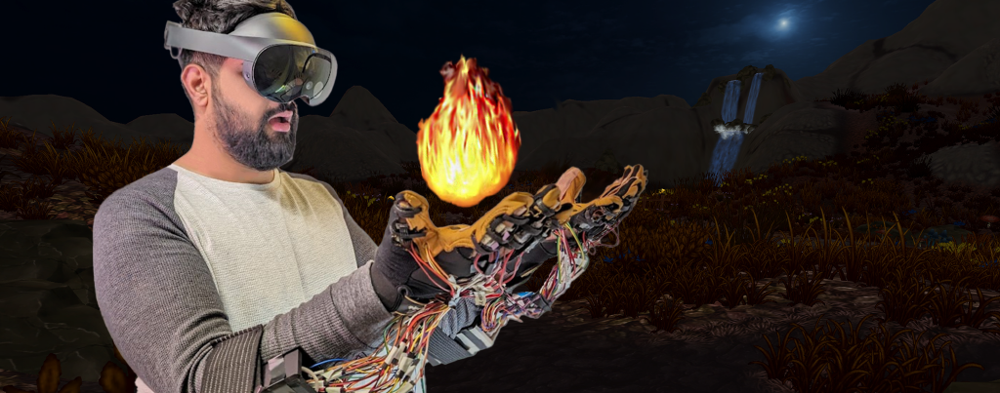

# Fiery Hands: Designing Thermal Glove through Thermal and Tactile Integration for Virtual Object Manipulation

[](./Documentation/fieryhands.pdf)
[](https://www.youtube.com/watch?v=M_gZlia0lZ8)
[](https://uist.acm.org/2024/)

---

## Project Description
We present a novel approach to render thermal and tactile feedback to the palm and fngertips through thermal and tactile integration. Our approach minimizes the obstruction of the palm and inner side of the fngers and enables virtual object manipulation while providing localized and global thermal feedback. By leveraging thermal actuators positioned strategically on the outer palm and back of the fngers in interplay with tactile actuators, our approach exploits thermal referral and tactile masking phenomena. Through a series of user studies, we validate the perception of localized thermal sensations across the palm and fngers, showcasing the ability to generate diverse thermal patterns. Furthermore, we demonstrate the efcacy of our approach in VR applications, replicating diverse thermal interactions with virtual objects. This work represents signifcant progress in thermal interactions within VR, ofering enhanced sensory immersion at an optimal energy cost

***

## Contributions

1. **Perception-based thermal glove design**  
   A unique glove design is presented that strategically arranges and integrates thermal and vibrotactile actuators (thermal on outer palm/back of fingers, vibrotactile on palm/fingertips) to minimize obstruction during virtual object manipulation while still supporting rich thermo-tactile feedback. 

2. **Localized thermal illusions via thermo–tactile integration**  
   The authors show that by leveraging vibrotactile-induced thermal referral and thermal masking, the system can provide localized thermal illusions at specific areas of the hand and fingers using relatively few thermal actuators, validated through user studies on optimal placement and pattern perception.

3. **Dynamic thermal effects for enhanced VR interaction**  
   Fiery Hands supports diverse spatial–temporal thermal patterns (localized and global effects) that enhance immersion and interaction in VR, and the paper demonstrates these capabilities in VR applications while emphasizing improved sensory immersion at an optimized energy cost.




---

## 📁 Repository Structure

* **[Documentation/](./Documentation)** — Full research paper (PDF) and technical specifications.

---

## 🛠️ Bill of Materials (BOM)
The following components were used to build the [Project Name] prototype:

| Category | Item | Purpose |
| :--- | :--- | :--- |
| **Haptic Actuator** | Tatoko B07Q1ZV4MJ | Haptic feedback on forearm |
| **Peltier** | FTED S017A026026 | Thermal output generation |

---

## 📄 Citing
If you use this work or the hardware design in your research, please cite our paper:

```bibtex
@inproceedings{10.1145/3654777.3676457,
author = {Wang, Haokun and Singhal, Yatharth and Gil, Hyunjae and Kim, Jin Ryong},
title = {Fiery Hands: Designing Thermal Glove through Thermal and Tactile Integration for Virtual Object Manipulation},
year = {2024},
isbn = {9798400706288},
publisher = {Association for Computing Machinery},
address = {New York, NY, USA},
url = {https://doi.org/10.1145/3654777.3676457},
doi = {10.1145/3654777.3676457},
booktitle = {Proceedings of the 37th Annual ACM Symposium on User Interface Software and Technology},
articleno = {101},
numpages = {15},
keywords = {Thermal Gloves, Thermal Illusions, Thermal Referral, Thermal and Haptic Interfaces, Virtual Reality},
location = {Pittsburgh, PA, USA},
series = {UIST '24}
}
